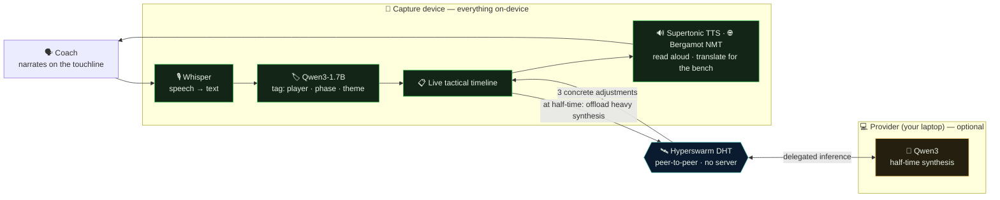
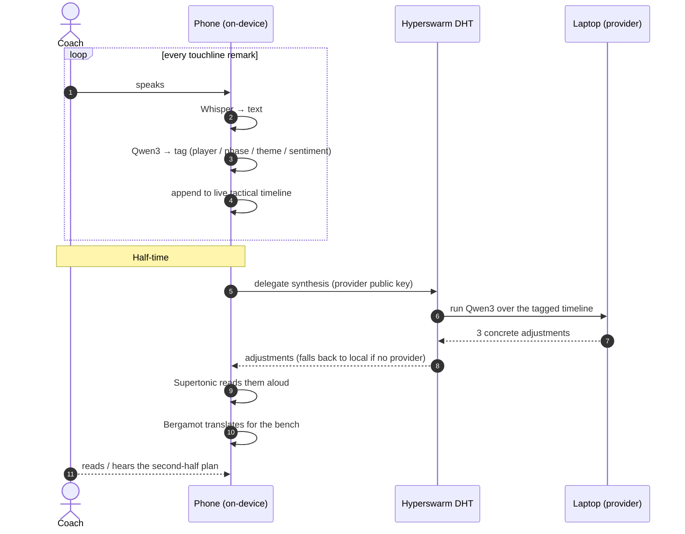

<div align="center">

# Gaffer ⚽

**A private, offline AI film room for grassroots football.**

Narrate from the touchline like you already do → it transcribes, tags, and builds a live tactical timeline on-device → at half-time it hands you three concrete adjustments, read aloud, in your language. No cloud, no API key, no subscription — the kids' data never leaves the touchline.

[](https://qvac.tether.io)
[](https://docs.pears.com)
[](https://nodejs.org)
[](LICENSE)
[](https://qvac.tether.io)

</div>

---

Gaffer turns a mid-range phone and an old laptop into a match analyst for the 99% of football that isn't professional. The coach talks; a **Whisper** model transcribes each remark, a **Qwen3** model tags it (which player, which phase, which theme), and a live tactical timeline builds itself. At half-time the heavy synthesis is **offloaded from the phone to the laptop over peer-to-peer** (QVAC delegated inference on the **Hyperswarm** DHT), and three specific adjustments come back — read aloud by an on-device **Supertonic** voice and translatable for a multilingual bench with **Bergamot**. Every model runs on your own hardware.

## The problem

Match analysis today means **Veo / Hudl / Trace**: thousands of dollars in hardware plus a cloud subscription, and your footage lives on their servers. That's priced and built for academies and pro clubs.

The tens of millions of **volunteer** coaches in Sunday-league, youth, and rec football get nothing. They can't afford it — and the footage contains **minors**, which legally and ethically can't be uploaded to a cloud AI in the first place. So the analysis simply never happens.

Gaffer is the free, private, offline option that didn't exist before. It exists *because* it's local: minors' data never touches a server, pitches often have no signal, and a volunteer can't manage API keys or billing.

## Why the stack is load-bearing, not decorative

| Leg | Why it is *required* here (not just nice) |
|---|---|
| **QVAC** — on-device AI | Minors' data can't go to a cloud; pitches have no signal; no API keys for a volunteer to manage. Uses STT + LLM + TTS + NMT, all local. |
| **Pears** — P2P delegation | A phone physically can't run the synthesis model, so it **offloads to the laptop over the DHT** (`delegate`), with local fallback. No server ever holds a child's data. |

Remove local AI → you're uploading children's footage to a cloud. Remove P2P → the phone can't do the compute. Neither leg is a logo. (WDK is deliberately *out* — it isn't load-bearing for this product, and a forced third track would only dilute the QVAC score. Full rationale in [`docs/DESIGN.md`](docs/DESIGN.md).)

## Architecture



If no provider is set, the synthesis simply runs locally (`fallbackToLocal`) — the provider only exists to demonstrate the phone→laptop offload.

## End-to-end flow



> The synthesis is the one heavy call — which is exactly why it's the piece delegated to the laptop, so a bigger, better model can run there.

## What works today

Five QVAC capabilities, all on-device, all verified end-to-end:

| Capability | Model | What it does |
|---|---|---|
| **Speech-to-text** | Whisper | Transcribes touchline narration (`src/stt.js`) |
| **LLM tagging** | Qwen3-1.7B | Player / phase / theme / sentiment per remark, ~0.2 s each |
| **LLM synthesis** | Qwen3 | Three concrete half-time adjustments — **delegated over P2P** |
| **Text-to-speech** | Supertonic | Reads the adjustments aloud (44.1 kHz) |
| **Translation** | Bergamot | Adjustments in ES · PT · FR · DE · IT for a multilingual bench |

A key detail: small models happily tag *"their 7"* as **our** #7. Gaffer resolves player identity **deterministically** (regex + the roster) and masks opponent references before synthesis, so it never coaches the other team — fully unit-tested.

## Running it

**Prerequisites:** Node.js **≥ 22.17** (tested on 24). Internet on the *first* run only — QVAC downloads the models (~2–3 GB) into `~/.qvac/models`, then it's fully offline. A GPU is optional (Metal on macOS, Vulkan on Linux/Windows); CPU works, just slower.

```bash
npm install

# Web UI — recommended. Live timeline + half-time card, with "Read aloud" (TTS)
# and "Translate for the bench" (NMT) buttons. Runs 100% locally, no provider needed.
npm run ui                 # → http://localhost:4600

# Terminal demo (scripted match, no microphone needed)
npm run demo

# Pure-logic tests (no models required)
npm test
```

### Optional: show the P2P offload

The half-time synthesis can run on a **separate machine (or process)** — the phone→laptop story. In one terminal start the provider; it prints a public key. Pass that key to the app in another terminal, and synthesis runs there over pure P2P.

```bash
# Terminal A — the "laptop"
npm run provider
#   → Provider public key:  4eafe78f7c73fc2ab98b8a8351635d30c2daacf...

# Terminal B — the "phone", offloading half-time synthesis to Terminal A
GAFFER_PROVIDER=4eafe78f7c73fc2ab98b8a8351635d30c2daacf... npm run ui
#   works with `npm run demo` too; the UI shows a "P2P → laptop" badge
```

`GAFFER_PROVIDER` is **entirely optional** — omit it and everything runs on one machine.
`GAFFER_TTS=1 npm run demo` also renders the spoken adjustments to `data/halftime.wav`.

## Repository layout

```
gaffer/
├─ src/
│  ├─ timeline.js       match state (roster, utterances, tags) — pure, tested
│  ├─ football.js       opponent-number detection + theme vocabulary — pure, tested
│  ├─ prompts.js        prompt construction + JSON extraction — pure, tested
│  ├─ tagger.js         on-device tagging + deterministic player resolution
│  ├─ synthesize.js     half-time synthesis (delegated over P2P when a provider is set)
│  ├─ provider.js       the "laptop": startQVACProvider — run to enable delegation
│  ├─ matchRunner.js    shared pipeline used by both the CLI and the web UI
│  ├─ stt.js            Whisper transcription
│  ├─ translate.js      Bergamot NMT (EN → ES/PT/FR/DE/IT)
│  ├─ server.js         zero-dependency local web server (SSE)
│  ├─ web/page.js       the single-page UI
│  ├─ demo.js           CLI demo runner
│  ├─ wav.js · ui.js    PCM→WAV, ANSI console helpers
│  ├─ qvac/             thin layer over the QVAC SDK + the exact model registry
│  └─ fixtures/         the scripted demo match
├─ test/                node:test unit tests for all the pure logic
├─ docs/DESIGN.md       full design + necessity rationale
└─ scripts/             dev smoke-tests for each QVAC capability
```

## Tech stack

| Layer | What |
|---|---|
| **Local AI** | `@qvac/sdk` — Whisper (STT), Qwen3-1.7B (LLM), Supertonic (TTS), Bergamot (NMT) |
| **P2P** | QVAC delegated inference over the **Hyperswarm** DHT (the Pears stack) |
| **Runtime** | Node.js ≥ 22.17, ES modules, GPU via Vulkan / Metal |
| **Web UI** | Zero-dependency Node `http` server + Server-Sent Events, self-contained HTML |
| **Tests** | `node:test` over the pure logic (timeline, tagging, prompts, helpers) |

## Roadmap

- **On-device LoRA fine-tuning (QVAC Fabric)** so feedback adapts to *your* squad over a season.
- **Whiteboard / team-sheet photo** via OCR + a vision-language model.
- **P2P report sharing** to players' devices over Hyperdrive (no server ever holds it).
- **Expo mobile build**, and — the stretch — sampling real video frames for automatic event detection.

## License

MIT — see [`LICENSE`](LICENSE).

<div align="center">
<sub>Gaffer · match analysis for the 99% of football that isn't professional. On your hardware, not theirs.</sub>
</div>
